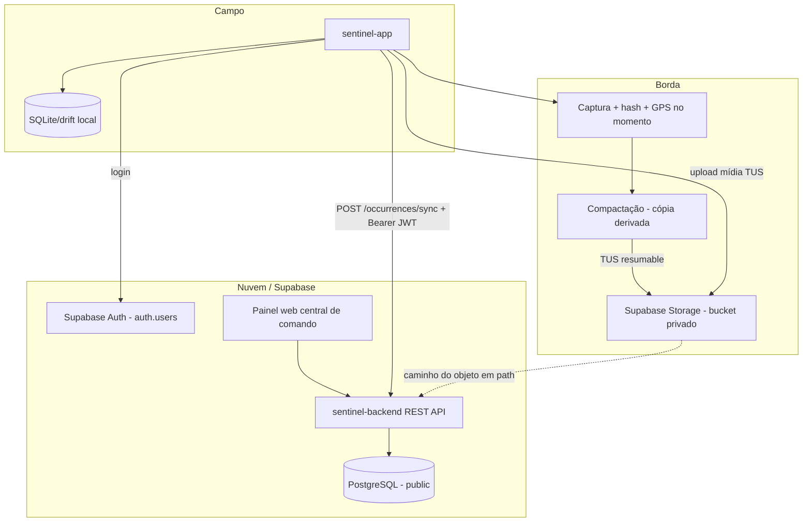

# Sentinel — Escopo do Ecossistema

Documento de referência de produto e arquitetura (o que o sistema **é/será**).
Para o histórico de decisões e o "porquê", ver `sentinel-decisoes.md`.

Última atualização: 2026-06-13

---

## 1. Visão geral do ecossistema

### O que é

O **Sentinel** é uma plataforma de monitoramento e resposta operacional composta por:

- **sentinel-app** — aplicativo móvel (Flutter/Android) para agentes em campo: captura *capture-first* de ocorrências offline, check-in de presença, e execução de missões.
- **sentinel-backend** — API REST e painel web de **central de comando** (triagem, classificação, mensageria, gestão de tasks e cadastros).

O fluxo principal divide-se em dois eixos:

| Eixo | Origem | Entidade | Quem atua |
|------|--------|----------|-----------|
| **Bottom-up** | Campo | `occurrences`, `check_ins` | Agente registra o que observou / marca presença |
| **Top-down** | Comando | `tasks` + `task_assignments` | Coordenador envia missões; agente aceita/rejeita na home |

### Arquitetura

- **App → Supabase Storage:** upload direto e **resumable (TUS)** de imagens/áudio/vídeo para **bucket privado** (backend não recebe binário).
- **App → Backend:** sincronização JSON das ocorrências e metadados de mídia (caminho do objeto), autenticada por JWT do Supabase.
- **Painel web → Backend:** triagem, kanban, mensageria, tasks, cadastros e atribuição (`assigned_to`).

### Onde encontrar contratos e decisões

| Documento | Conteúdo |
|-----------|----------|
| `STATUS_PROJETO.md` | **Fonte da verdade executável** — endpoints implementados, payloads, campos, status |
| `sentinel-scope.md` (este) | Visão de produto e arquitetura decidida |
| `sentinel-api-app.md` | Superfície de API que o app precisa, em ordem de build |
| `sentinel-decisoes.md` | Registro de decisões (antes → depois + porquê) |

---

## 2. Backend e painel web (`sentinel-backend`)

### Tecnologias e stack

| Camada | Tecnologia | Observação |
|--------|------------|------------|
| Framework | **Laravel** (PHP 8.3+) | API REST + painel web |
| Banco | **PostgreSQL** | App no schema `public`; testes no schema `testing` (isolado) |
| Chaves primárias | **UUID** | Geradas no App para ocorrências/mídias/check-ins |
| API | **REST JSON** | Prefixo `/api/v1/` |
| Autenticação | **Supabase Auth** | Identidade em `auth.users`; perfil em `public.users` (1:1 por id). Laravel valida o JWT do Supabase; `reported_by`/`user_id` derivados do token, nunca do payload |
| Mídias | **Supabase Storage (bucket privado)** | Upload TUS pelo App; backend persiste o **caminho do objeto** em `occurrence_media.path`; visualização via URL assinada |
| Hospedagem | **Supabase** (PostgreSQL + Auth + Storage) | |
| Dev local | **Supabase CLI (Docker)** | Stack local: Postgres `:54322`, Auth, Storage, Studio `:54323`, API `:54321`. Espelha produção |

### Controle de acesso (RBAC)

Acesso baseado em **papéis** (`roles`) vinculados a `users.role_id`.

| Conceito | Tabela | Uso |
|----------|--------|-----|
| Papel de sistema | `roles` | Permissões (admin, coordenador, agente…) |
| Usuário (perfil) | `users` | Domínio do operador: `role_id`, `municipality_id`, `photo_path`. Ligado 1:1 a `auth.users` |
| Equipe operacional | `groups` + `group_user` | Distribuição de tasks — **não** substitui `roles` |

Credenciais (senha, reset, MFA, tokens) são geridas pelo Supabase Auth, não pelo Laravel.

### Funcionalidades da central de comando (painel web)

| Módulo | Descrição | Status |
|--------|-----------|--------|
| **Triagem estratégica** | Fila de ocorrências; atribuição de revisor via `assigned_to` | Schema pronto; API/UI pendente |
| **Quadro de classificação (Kanban)** | Colunas por status/prioridade; drag-and-drop | Schema pronto; API/UI pendente |
| **Central de mensageria** | Comunicação comando ↔ campo | Pendente |
| **Tasks (missões)** | Criar missão, definir alvos, publicar, acompanhar aceites | Schema pronto; API/UI pendente |
| **Cadastro/admin de catálogo** | Observables, categorias, municípios, grupos, usuários, roles | Pré-requisito para o app baixar catálogo e testar |

**Decisão:** `tasks` **não possuem mídia própria**. Thumbnail vem de `occurrence_media` via `tasks.occurrence_id`.

### Estado atual (auditado em 2026-06-17)

- API app-facing (`GET /me`, catálogo delta, `POST /occurrences/sync`, `POST /check-ins/sync`) — **pronta e testada** (ver `STATUS_PROJETO.md`).
- Schema de domínio (12 tabelas principais + infra) — **pronto**.
- Storage privado + RLS — **pronto**.
- Inbox de tasks e painel web — **a construir** (ver `sentinel-api-app.md` P5).
- **Próximo foco:** app consumir API + upload/sync real (épico E10).

---

## 3. Aplicativo móvel (`sentinel-app`)

Stack: **Flutter**, Android, persistência local (**drift**).

### 3.1. Papel do App

- Registrar **ocorrências** offline com UUID local, captura *capture-first*.
- Anexar **mídias** (imagem/áudio/vídeo) com upload TUS para bucket privado.
- Marcar **presença** via check-in manual (localização em primeiro plano).
- Consultar e responder **tasks** atribuídas (inbox).
- Sincronizar fila pendente quando houver conectividade.

### 3.2. UX de captura (capture-first)

Fluxo estilo "stories": abrir o app → **câmera é a home** → 1 toque captura → só **depois** preenche o form mínimo (categoria, observável, nota). O form **nunca** bloqueia a captura. No momento da captura, o app carimba **hash (SHA-256) + GPS + timestamp** e cria o rascunho da ocorrência.

- Importar da galeria existe apenas como **fallback** (tier de menor integridade — captura não controlada pelo app).
- **Vídeo: máx. 4-5 min** por clipe (foco no momento decisivo; menos dados, menos transeuntes).
- Foto + áudio é caminho padrão preferível quando suficiente.

### 3.3. Integridade na captura (3 camadas)

Separar **integridade** de **transporte** (sem rigor forense; foco em confiabilidade):

1. **Captura (no device, instantâneo):** hash SHA-256 do original + GPS + timestamp. Serve para detectar upload truncado/corrompido.
2. **Transporte:** cópia **comprimida** (JPEG 80% / H.264 720p) sobe via TUS; marcada como derivada.
3. **Original:** preservado no device até subir/recuperar sob demanda; **não** descartado ao sincronizar a cópia.

Timestamp de **captura** (cliente) e de **recebimento** (`synced_at`, servidor) são campos distintos.

### 3.4. Offline-first: fila e sincronização

Toda ocorrência/check-in é salvo **imediatamente** em SQLite/drift local. Um worker em background despacha a fila quando há conectividade.

Máquina de estados por item: `local_saved → media_uploading → media_done → json_syncing → synced`, com `failed_phase` e `retry_count`. Timestamps locais: `created_local_at`, `media_uploaded_at`, `synced_at`, `last_attempt_at`, `failed_reason`.

**Ordenação:** mídia primeiro (TUS → bucket privado), JSON depois (`POST /occurrences/sync` com as URLs/caminhos resolvidos). Backend faz **upsert por `id`**. Job no backend limpa mídia órfã (sem ocorrência há mais de X tempo — carência obrigatória).

**Confirmação:** o item só é marcado `synced` quando a API retorna `200` **e** o `id` consta em `data.ids`. Caso contrário, permanece na fila para retry.

### 3.5. Upload de mídia (resumable + background)

- **TUS (resumable):** retoma de onde parou em conexão instável; suportado pelo Supabase (Pro). Upload padrão para arquivos < 6MB; TUS para vídeo.
- **Background "sincroniza e dorme":** Foreground Service (notificação persistente) sobrevive a tela apagada/app em segundo plano — **não** depende de o operador manter o app aberto.
- **Android 15:** usar **User-Initiated Data Transfer (UIDT) Jobs** (Android 14+) para contornar o limite de 6h do dataSync foreground service.
- **Rede:** vídeo **só em Wi-Fi** + botão de override manual; foto/áudio em qualquer rede.

### 3.6. Check-in (presença)

Botão de check-in manual: leitura única de **localização em primeiro plano** (sem tracking contínuo / sem permissão de background). Entidade leve `check_ins` (`id`, `user_id`, `latitude`, `longitude`, `accuracy`, `captured_at`, nota opcional), na mesma fila offline. Guardar `accuracy`; tratar fix lento e ausência de GPS. Sem rastreamento contínuo do operador (decisão de privacidade/LGPD).

---

## Decisões de domínio (referência rápida)

| Tema | Decisão |
|------|---------|
| Tipo de produto | Versão **defensável** (monitorar/documentar, não vigiar pessoas) |
| Autor da ocorrência | `reported_by` — **derivado do token**, não do payload |
| Alvo do report | `observable_id` opcional (catálogo admin) |
| Categoria | `category_id` opcional (catálogo admin) |
| Atribuição / triagem | `assigned_to` — somente painel web |
| Geo na ocorrência | `latitude` + `longitude`, carimbados na captura |
| Presença | `check_ins` — check-in manual, localização em primeiro plano |
| Task ↔ ocorrência | `tasks.occurrence_id` opcional |
| Mídia em tasks | **Não** — usar mídia da ocorrência vinculada |
| Autenticação | **Supabase Auth** + perfil em `public.users`; Laravel valida JWT |
| Upload de arquivos | App → Supabase Storage (TUS, **bucket privado**); backend só caminho |
| Captura | **Capture-first**; hash + GPS + timestamp no momento |
| Duração de vídeo | Máx. **4-5 min** |
| Sync em background | Foreground Service + UIDT (Android 14+) |
| Timestamps | `created_at`/`updated_at` do cliente persistem; `synced_at` do servidor |
| Dev local | Stack via Supabase CLI (Docker) |
| Push notifications | Fase avançada |
| Seeders | Tarefa separada (catálogo é pré-requisito de teste do app) |

---

## Documentos relacionados

- `STATUS_PROJETO.md` — status técnico e contratos de API
- `sentinel-api-app.md` — superfície de API que o app precisa, por prioridade
- `sentinel-decisoes.md` — registro de decisões
- `.cursor/rules/` — regras de projeto para o agente de código
